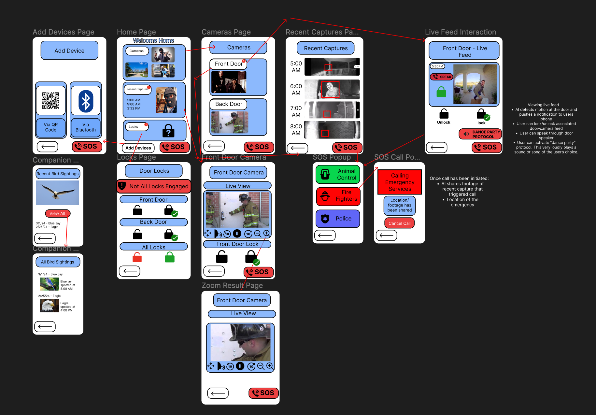

# Introduction
With various smart home devices requiring different applications, it can be hard to automate, control, and use these products. This application bundles every device into one, easy-to-use device that utilizes artificial intelligence to require minimal interaction from users post initial setup. Leveraging AI means users can feel safe in their homes while our application provides real-time detection of the outside world. By creating an application for users by users, less time will be spent on monitoring through various desirable functions. 

Come see the full article here - https://sites.google.com/view/css478andrzejdawiecportfolio/home

