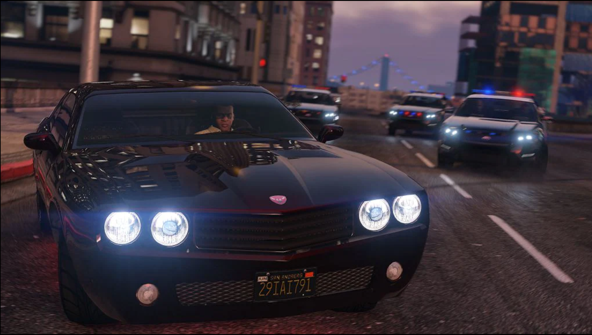
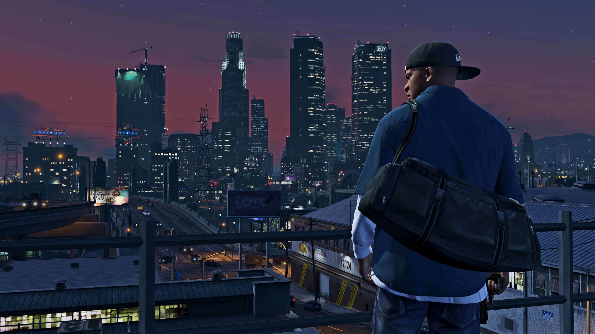

# Introduction
During the last couple of years, the Coronavirus epidemic has changed the habits of virtually everyone on the planet, no matter what country. Being quarantined inside one’s home means having the freedom to enjoy activities such as watching movies, listening to music, and playing video games. With the number of cars on the road being at a historic low, traffic safety in theory should’ve greatly improved; however, 29,000 people died in the first nine months of 2020 – A drastic 4.6 percent increase compared to 2019 at the same time. Since an incredibly high number of workers are still working from home, did influences such as the “Fast and Furious” franchise contribute to those deaths? Along with this question, does consuming content which glorifies illegal activities increase the chances of someone behaving badly, or are there other factors at play? With traffic deaths and crime on the rise, this was a question I personally wanted to answer. 

# A deep-dive into the issues

Being a car enthusiast since I was born, this question has often been on my mind when going to car shows before this pandemic. Many “harmless” activities during these shows, such as revving engines loudly, were often inspired by the movies themselves in order to imitate the actors and scenes. Unfortunately, though, huge portions of illegal street racing recently emerged which potentially endangers the lives of many drivers. Personally speaking, I know friends who went to these illegal events, and they often told me “Someone crashed and passed away”. This topic has the potential to introduce a lot of stakes at hand – From viewers of popular culture media, which are directly affected, to people who drive on our roads. While movies like the “Fast and Furious” franchise do have potential to impact the real world, this is just one portion of the entertainment industry. Video games like “Grand Theft Auto V” recently became the most profitable piece of entertainment in history, with over 150 million copies sold. Music, no matter what genre, is often listened to while driving as well. – Do these entertainment examples which potentially glorify illegal actions impact people’s behavior in the real world?

One of the biggest dangers drivers often face on the road are reckless drivers. These types of drivers not only endanger themselves, but other people and property. According to the studies of David A. Sleet and Bruce H. Jones in their scholarly book “Encyclopedia of Public Health”, reckless driving in general kills an average of 13,000 people each year according to the American Automobile Association Foundation for Traffic Safety. While this number compared to other causes of deaths does seem insignificant, the majority of these deaths were often people who were hit by the reckless driver. In the article, the National Highway Traffic and Safety Administration defines aggressive driving as “the operation of a motor vehicle in a manner that endangers or is likely to endanger persons or property”. (6) Combined together, speeding and reckless driving kill on average, more people than all alcohol-related car deaths. As the number of drivers on the road increase at a steady pace each year, it’s essential to understand if popular culture media has any influence on this drastically growing issue. 

Movies have been a huge influence in pop culture since the very beginning of entertainment. The “Fast and Furious” franchise specifically, has had more of an effect on modern car culture than any other influence; often becoming the “centerpiece” of conversation in many instances. From the very beginnings, “Fast and Furious” has specifically shown off dangerous illegal activities such as theft but most importantly, street racing. Going parallel with reckless driving, speeding alone is responsible for over 30 percent of road deaths in the United States as stated by Lester Breslow (6) According to a 2011 scholarly article by the American Psychological Association titled “What You See is What You Do: Risky Behaviors Linked to Risk-Glorifying Media Exposure”, the authors claim there is a strong overlap between exposure of media which includes risky behavior such as street racing, binge drinking, and unprotected sex, and those same people having greater risk-staking behaviors and attitudes which are often harmful. Backed by over twenty-five years of continuous research, the study found that “risk-glorifying media has potentially grave consequences, such as innumerable incidences of fatalities, injuries and high economic costs in a broad variety of risk-taking domains, such as substance abuse, reckless driving, gambling and risky sexual behavior”. (1) While the majority of their analysis was on test subjects between the ages of sixteen and twenty-four, the older test subjects had near identical results. This study potentially shows how much of an influence movies and other forms of media could potentially have on younger generations; however, where does Fast and Furious specifically fit into this equation?

# Analyzing real-world effects

Adding onto the effects of movies, “Do ‘Fast and Furious’ Movies Cause a Rise in Speeding?” by Anupam B Jena, Aakash Jain and Tanner R. Hicks from the New York Times specifically analyzes the effects of watching “Fast and Furious” in movie theaters and a person’s behavior after viewing. Using detailed traffic violation data from the years 2012 to 2017, a grand total of 192,892 speeding tickets were handed out in Montgomery County, Maryland. Yet as soon as a new Fast and Furious movie rolled into theaters, speeding tickets jumped a staggering twenty percent. On top of tickets themselves, the average ticketed speed also increased; from fifteen miles per hour, to over nineteen which equates to a staggering twenty-two percent upturn. The authors state with their study “We found a large increase in the average speed of drivers who received speeding tickets on the weekends after “Fast and Furious” releases.” (2) While these statistics are shocking, the most dangerous factor by far is the sheer amount of extreme speeding instances which potentially could be deadly. Extreme speeding in any scenario is defined as driving over forty miles per hour over the limit. These instances shockingly increased more than double in the same time frame. Could a potential “adrenaline rush” be the cause of this? Most interesting however, was the studies’ use of locational data, which noted many of the tickets were concentrated in areas close to movie theaters. Comparing movie premiere data to three weeks before the movie release, the authors found extreme speeding violations were not only less common, but were on average spread further out from theaters. Comparing “Fast and Furious” releases to something like “The Hunger Games”, the team found no correlation with any reckless driving and the movie itself; however, in the street racing world of “Fast and Furious”, those behaviors do influence the real world. Fortunately, most of the effects given are only temporary – Typically one to two weeks after the movie is gone, traffic goes back to normal. This information is significant as the short-term effects of the franchise itself is drastic, yet long-term wise, it seems to level itself out until a new movie comes out.

# Drawbacks

Video games are perhaps one of the most controversial pieces of entertainment. From the Kyle Rittenhouse trial to age restrictions, video games are often in hot water with real-world violence. With gaming overall being widely accepted by adults and children alike, it’s important to realize the influence these games have on the world, specifically violent video games. Many popular titles such as “Grand Theft Auto V”, “Call of Duty” and “Battlefield” glorify violence just like “Fast and Furious” glorifies street racing. Erik Kain’s popular article “Do Games Like 'Grand Theft Auto V' Cause Real-World Violence?” answers the correlation between tragedies such as mass shootings and violent video games such as “Grand Theft Auto V” specifically. Contrasting the New York Times article, the author claims violent video games along with their studies, “[have] ever shown that violent video games result directly in actual violence, let alone mass shootings. That doesn't mean it isn't possible, though the numbers suggest it's very unlikely.” (4) The author does make sense here – With over 155 million copies of Grand Theft Auto V sold over the last 8 years, it’s not only one of the most popular video games in history, but it’s the most profitable piece of entertainment ever. No movie, music album, or other game has come close. With these shocking numbers, the direct correlation of violent video games and violent behavior would be terrifying. Using statistics from 2013, the author states how every day in this country, thirty people are murdered with a gun, while 162 are injured. While these unfortunate numbers are too much already, 155 million potential killers would drastically increase those numbers. Expanding on his claim, the author further elaborates by stating “If there is truly a direct, causal link between games like Grand Theft Auto V and violent shootings, we will soon have 18 to 20 million killers on our hands, not to mention the countless millions more who have been playing violent video games for years.” (4)

Despite directly going against the Fast and Furious article, both sources do mention that video games often decrease real-world violence, as these games are often the “crime” themselves. A person’s violent behavior is often “released” in the game rather than the real world. A fantastic example of this is from a scholarly article written by Marinus Beerthuizen and Laan Gijs titled “The release of Grand Theft Auto V and registered juvenile crime in the Netherlands. European Journal of Criminology.” Their research consisted of studying the Netherlands region specifically on the effects of the “Grand Theft Auto” series. With such a violent game at hand, the logical guess would be that crime increased as people are “inspired” to recreate these events in the real world; however, crime instead went down thirty percent. Unlike Fast and Furious, which provides short-term consequences, video games like “Grand Theft Auto V” provide long-term benefits to reduce violence and crimes. The author expands on this claim by stating “if GTAV was capable of incapacitating juveniles, this effect was long term, instead of only immediate and short term…”(3) The author effectively argues 99.99 percent of players who plays violent games think of these titles as an escape from “the real world’ in a way, with the remaining percentage being a factor of a different cause, such as mental health issues. With tragedies such as mass shootings occurring on what seems to be a monthly-basis, the author states video games should be treated as “virtual, temporary, and entirely fantastical” (3) which often provide long-term benefits of potentially decreasing crime nationwide. 

Driving itself is an activity that people often enjoy alone, but music further enhances that experience. With music being a popular piece of entertainment as well, “The influence of music on mood and performance while driving” by Marjolein van der Zwaag, Christ Dijksterhuis, Dick de Waard, Ben Mulder, Joyce Westerink, and Karel A Brookhuis discusses the positive correlation with listening to music and driving. Being a driver myself, I often find myself listening to music especially in the morning in order to bring some energy into the day. This directly goes with the author’s claim that “study shows that listening to music can positively impact mood while driving, which can be used to affect state and safe behaviour. Additionally, driving performance in high demand situations is not negatively affected by music.” (9) While music can potentially offer a safer and more pleasant drive, there is a limit in which music turns into a distraction rather than an enjoyment. For a more specific article, . “What you need to know about how music influences driving” by the OneNie deep-dives into the factors which turn music into a distraction. According to a 2013 statistic, drowsy driving was responsible for more than 72,000 car crashes in the US alone – Without music, these statistics would most likely increase as more drivers would simply “pass out” at the wheel. While volume has a definite limit, specific music genres such as rock often have a greater effect. The author expands on this factor by mentioning “According to this study, some music genres were found to foster road rage and aggressive driving behaviors. They also observed that more than 60% of rock fans admit to swearing or gesturing at other drivers and more than 30% of those drivers have been involved in a minor accident.” (8) Rock music is often portrayed as “violent music” by having lots of energetic vibes; however, surprisingly jazz music is the most likely genre to get speeding fines as mental workload increases, meaning one has less time to focus on their speed and drive. 

These popular culture medias are extremely popular right now and are projected to increase at astronomical rates. In theory however, most likely people who listen to music often watch movies, and potentially play video games as well – what happens then? Theoretically speaking, someone who listens to heavy metal music, plays violent games, and is coming out of a “Fast and Furious” screening in theory has a higher chance of driving recklessly and speeding than a “normal” person. What scientists need to understand is these sources together state that there is overlap between consuming crime-glorifying medias and violence in the real world, but this outlet and angle on its own is being targeted for all the wrong reasons. This research essentially proves that violence and bad behavior in the real world is not a relationship to popular culture forms of media, but rather some other factors such as untreated mental illness. Mental illness its own can potentially offer incredible amounts of damage compared to watching a movie for example, as movies are short-term effects. These sources together show that there isn’t enough correlation to prove these forms of media cause reckless driving on their own. 

.")

# Closing statement 

Throughout the course of this research, I was surprised to see many of these popular culture medias often stagnate or even reduce real-world crimes. Being part of the car enthusiast world, my experiences have shown that many of these reckless drivers do “dumb things” because they simply want to show off, not because they watched “Fast and Furious” and listened to rock music. While violence and reckless driving deaths are both increasing each year, scientists need to realize that popular culture media hinders negative effects for short-term only, and let people enjoy their movies and cars – As this will never disappear from our culture. 

# References

1.	American Psychological Association. (2011, March 7). What you see is what you do: Risky behaviors linked to risk-glorifying media exposure [Press release]. http://www.apa.org/news/press/releases/2011/03/risky-behavior

2.	Anupam. (2018, January 30). Do 'fast and furious' movies cause a rise in speeding? The New York Times. Retrieved December 5, 2021, from https://www.nytimes.com/2018/01/30/upshot/do-fast-and-furious-movies-cause-a-rise-in-speeding.html. 

3.	Beerthuizen, Marinus & Weijters, Gijs & Laan, André M.. (2017). The release of Grand Theft Auto V and registered juvenile crime in the Netherlands. European Journal of Criminology. 14. 147737081771707. 10.1177/1477370817717070.

4.	Kain, E. (2014, June 12). Do games like 'grand theft auto V' cause real-world violence? Forbes. Retrieved November 6, 2021, from https://www.forbes.com/sites/erikkain/2013/09/18/do-games-like-grand-theft-auto-v-cause-real-world-violence/?sh=408598093241. 

5.	Reckless driving accident attorney Hallandale South Florida. Fenstersheib Law Group, P.A. (2018, October 1). Retrieved November 20, 2021, from https://www.tellrobert.com/accidents/reckless-driving-accidents/an-overview-of-reckless-driving-accidents/.

6.	Sleet, David A., and Bruce H. Jones. "Reckless Driving." Encyclopedia of Public Health, edited by Lester Breslow, vol. 3, Macmillan Reference USA, 2002, p. 1015. Gale eBooks, link.gale.com/apps/doc/CX3404000718/GVRL?u=wash_main&sid=bookmark-GVRL&xid=1ebf3caf. Accessed 26 Oct. 2021.

7.	 (2018, January 30). Do 'fast and furious' movies cause a rise in speeding? Pro Ideas. Retrieved November 20, 2021, from https://procoolideas.blogspot.com/2018/01/do-fast-and-furious-movies-cause-rise.html.

8.	What you need to know about how music influences driving. Onenie. (n.d.). Retrieved November 20, 2021, from https://onenie.com/what-you-need-to-know-about-how-music-influences-driving.

9.	van der Zwaag MD, Dijksterhuis C, de Waard D, Mulder BL, Westerink JH, Brookhuis KA. The influence of music on mood and performance while driving. Ergonomics. 2012;55(1):12-22. doi: 10.1080/00140139.2011.638403. PMID: 22176481.

